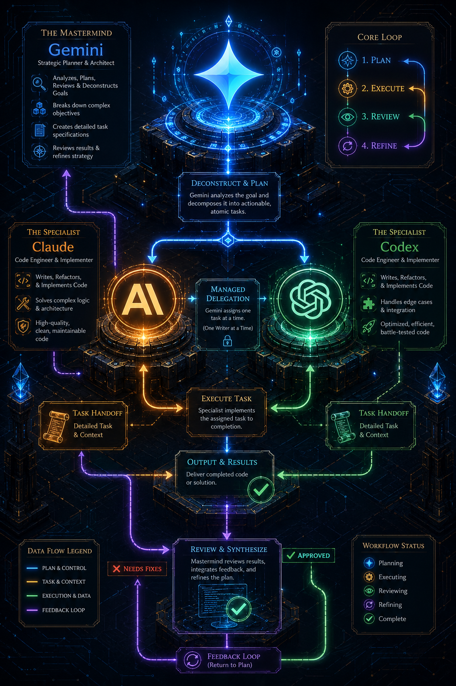

# The AI Protocol: A Hero's Journey

---

## 🛡️ The Party (Roles)

| Role | The Hero | The Mission |
| :--- | :--- | :--- |
| **Mastermind** | **Gemini** | **Strategize & Review.** Breaks big goals into tactical task files. |
| **Specialist** | **Codex / Claude** | **Implement & Forge.** Executes the code, runs tests, and fixes bugs. |
| **Sovereign** | **Human (You)** | **Direct & Approve.** Sets the goal and gives the final merge seal. |

---

## 🗺️ The Quest (Workflow)

1. **📜 The Blueprint**: Gemini plans the goal into `ai-protocol-tasks/`.
2. **⚔️ The Battle**: Gemini invokes a Specialist (`codex` or `claude`) to implement.
3. **🔍 The Inspection**: Gemini reviews the code. If flawed, it returns to **Step 2**.
4. **👑 The Triumph**: You merge the approved code.

---

## 💎 Why It Wins

### 🫧 Pristine Context
The Mastermind doesn't get bogged down in "debugging loops." Its memory stays clean, focused only on the high-level architecture.

### 👁️ Fresh Review
Reviewing your own code is a trap. By splitting the **Writer** and the **Reviewer**, we eliminate blind spots and ensure high-quality output.

### ⚡ Best-in-Class Synergy
Combine Gemini’s vast reasoning with Claude or Codex’s surgical coding speed. One brain for strategy, another for the steel.

---

## 🧠 The Mastermind’s Infinite Memory

When a campaign moves from a single village to a massive empire (a very large repo), Gemini’s **Massive Context Window** becomes our greatest weapon.

*   **The Global Map**: While Specialists (Codex/Claude) are focused on the room they are in, Gemini holds the entire kingdom in its mind. It sees how a change in the "Dungeons" affects the "Royal Treasury" three subsystems away.
*   **Spotting the Trap**: Gemini’s ability to ingest 1M+ tokens means it can "read the entire library" before drawing the first blueprint. It identifies global dependencies and architectural risks that a focused Specialist would miss.
*   **The Ultimate Planner**: In large repos, the hardest part isn't writing the code—it's knowing **where** to write it. Gemini is the only hero capable of scouting the entire continent in a single turn.

---

## 📜 The Campaign Lore
All decisions are recorded in `ai-protocol-tasks/decisions.md`. No matter how many agents rotate through the project, the **Lore** is never lost.

---

## 🏹 Choosing Your Battle Strategy

Not all quests are the same. Here is how our Protocol compares to other agent patterns:

| Pattern | How it Works | When to Use |
| :--- | :--- | :--- |
| **Subagents** | One "Parent" agent spawns specialized "Children" (e.g., `invoke_agent`). | Quick, isolated tasks within a single session. |
| **Multi-Agents** | A swarm of agents talking directly in a "black box" loop. | Rapid prototyping where human audit isn't the priority. |
| **Managed Agents** | One CLI (Gemini) directly runs other CLIs in your shell. | **Speed.** Best for active, high-tempo development in one terminal. |
| **The Protocol** | Agents collaborate via **shared markdown files** (`ai-protocol-tasks/`). | **The Gold Standard.** Best for large projects and durable team history. |

### 🛠️ Why "The Protocol" is the Gold Standard
While **Managed Agents** are fast, **The Protocol** is built for the **Long Campaign**:
- **Durability**: If your session ends, the state is saved in the file. 
- **Auditability**: You can read every review and decision months later.
- **Portability**: Anyone on the team can pick up the quest exactly where it left off.
